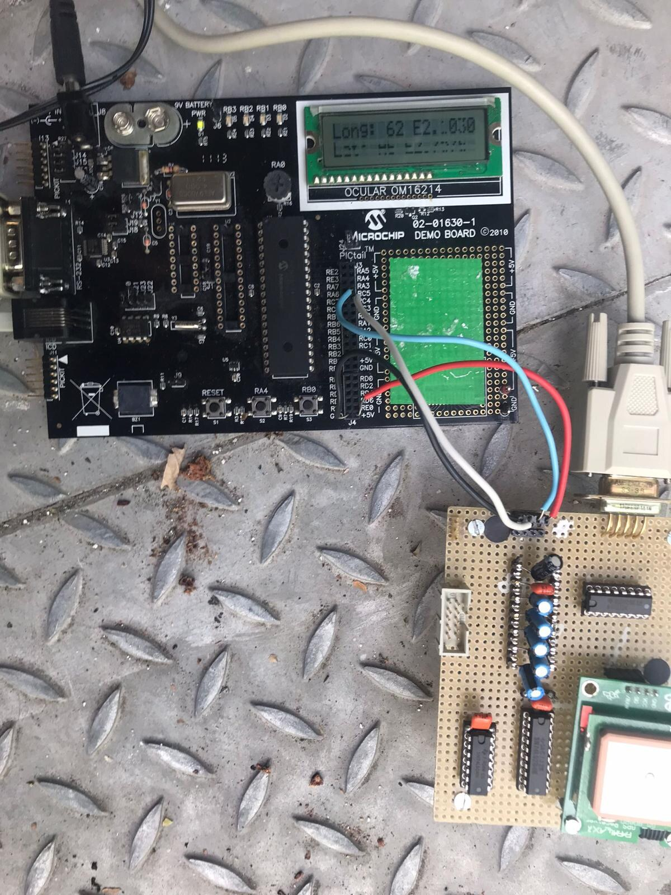

# PIC GPS Receiver

PIC microcontroller project that communicates with a GPS module over a register-configured UART and displays position, date, time, satellite count and altitude on an LCD.

## Repository guide

| Location | Contents |
|---|---|
| [Codes/](Codes/) | Main GPS application and serial routines |
| [documentation/](documentation/) | Project reports and presentation |
| [docs/](docs/) | Module and interface datasheets, original reports |
| [assets/](assets/) | Hardware and LCD photographs |
| [archive/](archive/) | Original MPLAB projects and LCD experiments |
| [firmware/](firmware/) | Preserved programmed firmware images |

## Getting started

Use MPLAB with the original HI-TECH PIC C toolchain and the PICDEM 2 Plus hardware configuration. Start with the sources in `Codes/`; the archived projects preserve LCD drivers and original compiler settings.

## Project context

Academic project developed with Sarah Dahmoun. The original code depends on the PIC compiler headers and board interfaces; it is not a desktop C program.
