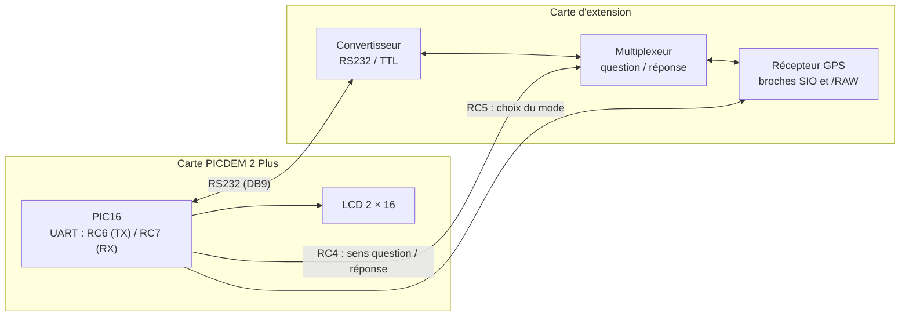
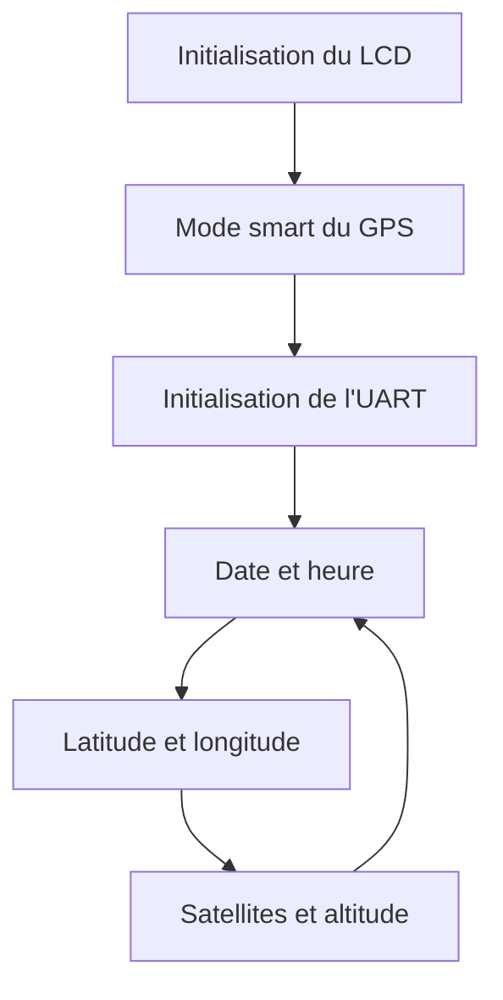

# Récepteur GPS sur microcontrôleur PIC

Lecture d'un module GPS par un microcontrôleur PIC16 et affichage de la date, de l'heure, de la latitude, de la longitude, du nombre de satellites et de l'altitude sur un écran LCD. Le programme est écrit en C, sans bibliothèque de liaison série : l'UART est configurée registre par registre.


*Montage complet : carte de développement PICDEM 2 Plus (à gauche) et carte d'extension portant le récepteur GPS (en bas à droite).*

## Sommaire

1. [Présentation](#présentation)
2. [Matériel et outils](#matériel-et-outils)
3. [Architecture du montage](#architecture-du-montage)
4. [Liaison série](#liaison-série)
5. [Protocole du module GPS](#protocole-du-module-gps)
6. [Organisation du code](#organisation-du-code)
7. [Déroulement du programme](#déroulement-du-programme)
8. [Résultats](#résultats)
9. [Limites et améliorations](#limites-et-améliorations)
10. [Compilation](#compilation)

## Présentation

- **Cadre** : projet de microcontrôleur, première année du cycle ingénieur Instrumentation, Sup Galilée (Université Sorbonne Paris Nord).
- **Équipe** : projet réalisé en binôme avec Sarah Dahmoun.
- **Objectif** : faire dialoguer un PIC avec un récepteur GPS par liaison série asynchrone, décoder les réponses et les afficher sur le LCD de la carte.
- **État** : projet académique terminé, non maintenu.

## Matériel et outils

| Élément | Détail |
|---|---|
| Carte | Microchip PICDEM 2 Plus Demo Board |
| Microcontrôleur | PIC16 de la famille 16F87xA (en-tête `pic168xa.h`), oscillateur 4 MHz |
| Récepteur GPS | Module piloté par commandes `!GPS`, utilisé en mode « smart » |
| Carte d'extension | Convertisseur RS232/TTL et multiplexeur question/réponse vers la broche SIO du module |
| Affichage | LCD 2 × 16 caractères de la carte (OCULAR OM16214) |
| Compilateur | HI-TECH PICC, sous MPLAB, programmation par ICD 3 |

## Architecture du montage

Le module GPS communique sur une seule broche bidirectionnelle (SIO). La carte d'extension adapte les niveaux RS232/TTL et aiguille cette broche soit vers l'émission du PIC (question), soit vers sa réception (réponse).



| Broche du PIC | Rôle |
|---|---|
| RC6 / RC7 | Émission / réception UART, via le connecteur RS232 de la carte |
| RC4 | Sens de l'échange : `0` pour envoyer une question, `1` pour lire la réponse |
| RC5 | Sélection du mode du module (`1` : mode smart) |
| PORTD | Écran LCD |

## Liaison série

La liaison est asynchrone, à 4800 bauds, 8 bits de données, sans parité (durée d'un bit : 1/4800 ≈ 208 µs).

Avec `BRGH = 1`, la vitesse vaut `Fosc / (16 × (SPBRG + 1))`. Pour un oscillateur à 4 MHz et `SPBRG = 51`, on obtient 4 MHz / (16 × 52) ≈ 4808 bauds, soit un écart d'environ 0,2 % par rapport à 4800.

Configuration réalisée dans `init_liaison_serie()` :

| Étape | Bits | Effet |
|---|---|---|
| Vitesse | `BRGH = 1`, `SPBRG = 51` | 4800 bauds |
| Mode | `SYNC = 0`, `SPEN = 1` | Asynchrone, broches RC6/RC7 affectées à l'UART |
| Interruptions | `TXIE = 0`, `RCIE = 0` | Aucune : émission et réception par scrutation |
| Format | `TX9 = 0`, `RX9 = 0` | 8 bits |
| Activation | `TXEN = 1`, `CREN = 1` | Émetteur et récepteur validés |

L'émission attend le drapeau `TXIF` avant d'écrire dans `TXREG` ; la réception attend `RCIF` avant de lire `RCREG`.

## Protocole du module GPS

En mode smart, le module ne diffuse pas de trames en continu : il répond à des requêtes. Chaque requête est la chaîne ASCII `!GPS` suivie d'un octet de commande, et la réponse est une suite d'octets binaires.

| Commande | Code | Octets reçus | Contenu lu par le programme |
|---|---|---|---|
| `GetSats` | `0x02` | 1 | Nombre de satellites |
| `GetTime` | `0x03` | 3 | Heures, minutes, secondes (UTC) |
| `GetDate` | `0x04` | 3 | Date |
| `GetLat` | `0x05` | 5 | Degrés, minutes, fraction de minute (16 bits), direction |
| `GetLong` | `0x06` | 5 | Degrés, minutes, fraction de minute (16 bits), direction |
| `GetAlt` | `0x07` | 2 | Altitude (16 bits) |

Les valeurs sur 16 bits arrivent octet de poids fort en premier et sont recomposées par `(octet_haut << 8) + octet_bas`.

## Organisation du code

```
Codes/
├── GPS _main.c        Programme principal : initialisations puis boucle d'affichage
├── Functions_gps.c    UART, sélection du mode, requêtes et décodage des réponses
└── Functions_gps.h    Constantes, variables partagées et prototypes
assets/                Photos du montage
```

| Fonction | Rôle |
|---|---|
| `init_liaison_serie()` | Configure l'UART à 4800 bauds |
| `emet_car()` / `emet_string()` | Envoie un caractère ou une chaîne (RC4 à `0`) |
| `recoit_car()` | Attend et renvoie un octet reçu (RC4 à `1`) |
| `init_gps_mode_smart()` | Configure RC4 et RC5 en sortie et sélectionne le mode smart |
| `request_gps(commande)` | Envoie `!GPS` + commande, puis range la réponse dans les variables globales |

## Déroulement du programme



Chaque écran affiche deux informations, une par ligne du LCD. Les octets reçus sont convertis en caractères chiffre par chiffre (division et modulo 10), sans `printf`.

## Résultats

Le dialogue avec le module fonctionne : les requêtes sont envoyées, les réponses sont reçues et les six grandeurs s'affichent sur le LCD.

| Écran de date | Écran d'altitude |
|---|---|
|  |  |

Les photos montrent le fonctionnement de la chaîne de communication et d'affichage. Les valeurs visibles (date, altitude) ne correspondent pas à une position réelle validée : aucune mesure de précision n'a été faite, et rien n'est annoncé à ce sujet.

## Limites et améliorations

- **Fichiers manquants** : `functions.h` et `lcdbt.h` (temporisations et pilote du LCD, fournis pour les travaux pratiques) ne sont pas dans le dépôt. Le projet ne se compile pas sans eux.
- **Validité non vérifiée** : la commande de validité du signal du module n'est pas utilisée ; le programme affiche ce qu'il reçoit, même sans réception satellite correcte.
- **Direction** : l'octet de direction (N/S, E/O) est envoyé tel quel au LCD au lieu d'être converti en lettre.
- **Satellites** : l'affichage du nombre de satellites écrit des chiffres en double.
- **Date** : l'ordre jour/mois à la réception est à vérifier par rapport à la documentation du module.
- **Réception bloquante** : `recoit_car()` attend indéfiniment ; si le module ne répond pas, le programme se fige. Un délai de garde serait nécessaire.
- **Changement d'écran par bouton** : une version utilisant l'interruption du bouton RB0 pour changer d'écran a été présentée en soutenance ; elle ne figure pas dans le code de ce dépôt, qui fait défiler les écrans automatiquement.
- **Structure** : les variables globales sont définies à la fois dans le `.h` et dans les `.c` ; elles devraient être déclarées `extern` dans l'en-tête.

## Compilation

1. Créer un projet MPLAB pour le PIC de la carte avec le compilateur HI-TECH PICC.
2. Ajouter les trois fichiers du dossier `Codes/` ainsi que `functions.h` et `lcdbt.h`.
3. Compiler, puis programmer la carte.

Bits de configuration utilisés : `__CONFIG(HS & WDTDIS & BOREN & LVPDIS)` (oscillateur HS, chien de garde désactivé, reset sur chute de tension activé, programmation basse tension désactivée).

> La compilation n'a pas été rejouée lors de la rédaction de cette documentation : la dernière version validée est celle réalisée pendant le projet.

## Licence

Aucune licence n'a été définie pour ce code.
