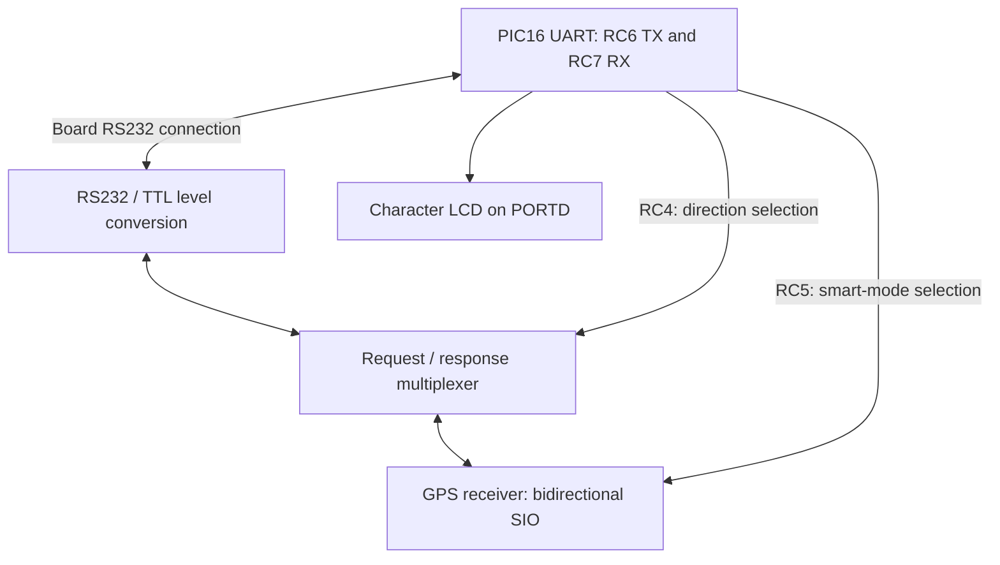
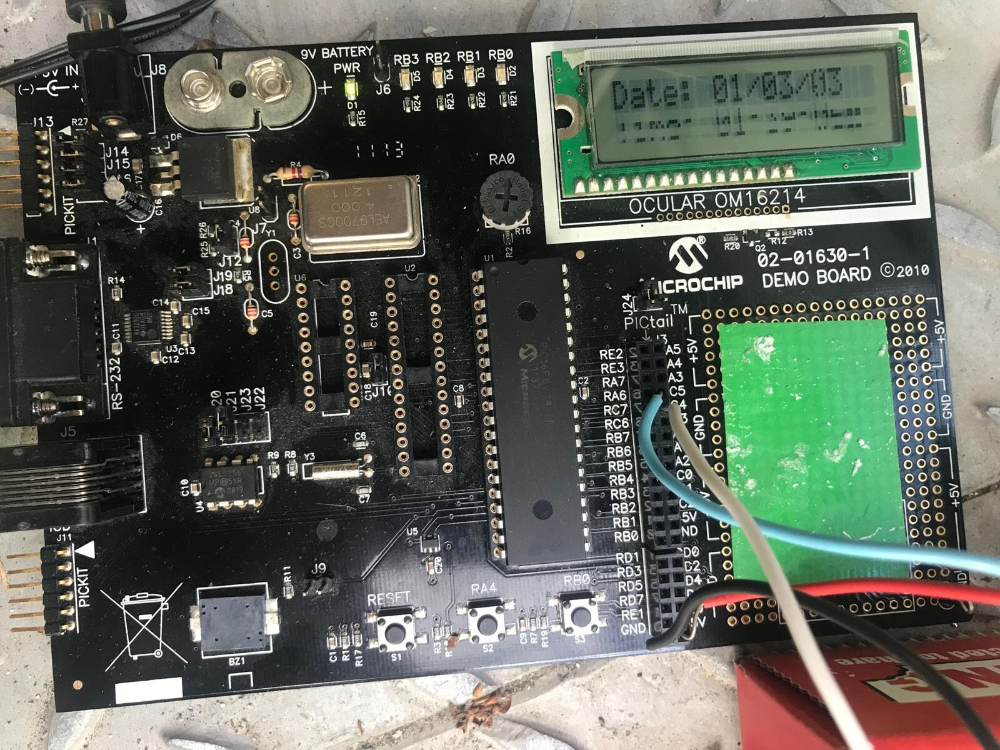
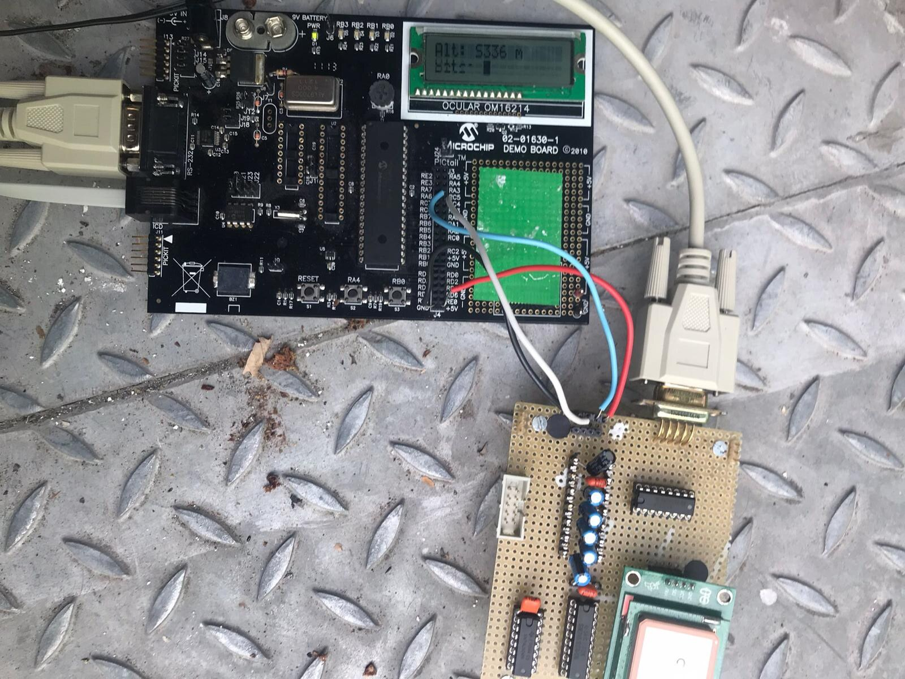

# PIC GPS Receiver Interface

A bare-metal embedded C project that interfaces a GPS receiver with a PIC16 microcontroller through a register-configured UART. The firmware sends binary request commands, decodes the receiver's responses and displays date, time, coordinates, satellite count and altitude on a character LCD.

**Embedded C · PIC16 · UART Registers · RS232/TTL Interfacing · Binary Protocols · Bit Manipulation · LCD Integration**


*PICDEM 2 Plus development board connected to the GPS extension hardware.*

## Project Overview

| Item | Details |
|---|---|
| Context | First-year engineering microcontroller project, Instrumentation, Sup Galilée, Université Sorbonne Paris Nord |
| Authors | Tedj El Moulk Sinacer and Sarah Dahmoun |
| Supervisor | M. Min Lee, credited in the project presentation |
| Development board | Microchip PICDEM 2 Plus Demo Board |
| MCU family | PIC16F87xA, referenced through `pic168xa.h`; exact fitted device should be checked on the board |
| Oscillator assumption | 4 MHz |
| Toolchain | MPLAB with HI-TECH PICC; ICD 3 programming/debugging |
| Status | Completed academic prototype; historical source and documentation |

The GPS receiver performs satellite positioning internally. The PIC implements the peripheral interface, request sequencing, binary decoding and display logic. This project concerns receiver interfacing, rather than implementation of a satellite-position solver.

## Embedded Engineering Scope

The project exercises several low-level firmware tasks:

- configuring a serial peripheral through individual register bits;
- calculating a baud-rate generator divisor from the oscillator frequency;
- transmitting and receiving bytes by polling peripheral status flags;
- selecting the direction of a shared GPS serial line through external hardware;
- separating ASCII command prefixes from binary payloads;
- reconstructing multi-byte values using shifts and integer arithmetic;
- formatting numbers for a character display without `printf`;
- integrating application logic with legacy compiler and board-support dependencies.

The UART path does not use a high-level serial library, an RTOS, DMA or an interrupt-driven receive buffer in the preserved source.

## Hardware Architecture

The extension board adapts RS232 and TTL signal levels and switches the receiver's single bidirectional SIO line between request transmission and response reception.



| Connection | Function |
|---|---|
| RC6 / RC7 | UART transmit / receive pins |
| RC4 | External direction selection: 0 for request transmission, 1 for response reception |
| RC5 | GPS mode selection: 1 for smart mode in this application |
| PORTD | LCD interface |
| LCD | Board's 16 × 2 OCULAR OM16214 character display |

RS232/TTL conversion is an electrical interface function. UART framing and GPS command decoding are implemented separately in firmware.

The source contains an older comment associating RC4 with the RAW pin. The operational assignments above follow the existing project description and code behaviour; confirm the extension-board schematic before recreating the wiring.

## UART Configuration

### Baud-Rate Generator

The project uses asynchronous high-speed mode:

```text
baud = Fosc / (16 × (SPBRG + 1))

Fosc  = 4,000,000 Hz
SPBRG = 51
baud  ≈ 4,807.69 bit/s
error ≈ +0.160% relative to 4,800 bit/s
```

At the nominal 4,800 bit/s rate, one bit lasts approximately 208.33 µs. An 8-bit asynchronous character with one start bit and one stop bit occupies 10 bit periods, approximately 2.083 ms.

The theoretical report includes parity examples; the preserved UART initialization selects 8-bit transfers and does not implement a parity-generation layer.

### Register and Bit Settings

[`init_liaison_serie()`](Codes/Functions_gps.c) sets the peripheral control bits directly.

| Register or control | Setting | Purpose in this implementation |
|---|---|---|
| `TXSTA.BRGH` | 1 | High-speed baud-rate generation |
| `SPBRG` | 51 | Divisor for the 4 MHz oscillator assumption |
| `TXSTA.SYNC` | 0 | Asynchronous operation |
| `RCSTA.SPEN` | 1 | Enable the serial peripheral |
| `TRISC6`, `TRISC7` | 1 | UART pin-direction values used by the source |
| `TXIE`, `RCIE` | 0 | Disable UART transmit and receive interrupts |
| `RCSTA.ADDEN` | 0 | Disable address-detection mode |
| `TXSTA.TX9`, `RCSTA.RX9` | 0 | Select 8-bit data transfers |
| `TXSTA.TXEN` | 1 | Enable transmission |
| `RCSTA.CREN` | 1 | Enable continuous reception |

The exact device datasheet and board configuration must be used when restoring this legacy project; the register settings are documented here as implemented, rather than claimed to be portable to every PIC16 variant.

### Byte Transmission and Reception

| Function | Operation |
|---|---|
| `emet_car(byte)` | Selects transmit direction through RC4, waits for `TXIF`, then writes `TXREG` |
| `emet_string(ptr)` | Iterates through a null-terminated string and sends each byte |
| `recoit_car()` | Selects receive direction, waits for `RCIF`, then reads `RCREG` |

The transmit routine checks buffer availability. It does not explicitly check `TRMT` before switching the external line direction. The report identifies the transmit shift register and its empty status; a restored implementation should distinguish a writable transmit buffer from completion of the last byte on the wire.

## GPS Smart-Mode Protocol

### Initialization

`init_gps_mode_smart()` configures RC4 and RC5 as outputs, selects request transmission with `RC4 = 0`, selects smart mode with `RC5 = 1` and applies a 10 ms initialization delay.

### Request Format

Each transaction sends a four-byte ASCII prefix followed by a raw command byte:

```text
Byte index:    0      1      2      3      4
Payload:      '!'    'G'    'P'    'S'   command
Hex prefix:   0x21   0x47   0x50   0x53

Example GetTime request: 21 47 50 53 03
```

The prefix is transmitted without its C-string null terminator. The command is a binary byte, not an ASCII digit.

Responses are parsed as fixed-length binary values. The implemented smart-mode path does not parse NMEA sentences.

### Command Map

| Command | Byte | Expected response length | Fields read by the firmware |
|---|---|---|---|
| `GetSats` | `0x02` | 1 byte | Satellite count |
| `GetTime` | `0x03` | 3 bytes | Hours, minutes, seconds |
| `GetDate` | `0x04` | 3 bytes | Assigned to day, month, year |
| `GetLat` | `0x05` | 5 bytes | Degrees, minutes, fractional-minute high byte, low byte, direction |
| `GetLong` | `0x06` | 5 bytes | Same field layout as latitude |
| `GetAlt` | `0x07` | 2 bytes | Altitude high byte, low byte |

The table describes the decoder's field interpretation. When adapting it to a receiver, align byte order, field units, signedness and hemisphere codes with that receiver's protocol; these are part of the transport-to-application contract.

### Transaction Sequence

`request_gps()`:

1. sends `!GPS`;
2. sends the command byte;
3. waits 100 ms;
4. selects the receive direction;
5. reads the expected number of bytes through blocking calls;
6. writes the decoded fields into global variables.

The `GetSats` branch also includes a 3 s display delay inside the protocol function.

The 100 ms wait precedes reception and line-direction switching. Trace the last transmitted stop bit, RC4 transition and first response byte together: that sequence determines whether the handover fits the receiver latency and UART buffering.

## Binary Decoding

### Multi-Byte Values

The code receives the most significant byte first and reconstructs fractional minutes and altitude as:

```c
value = (high_byte << 8) + low_byte;
```

An explicitly typed form for a future port, assuming a compiler with fixed-width integer support, would be:

```c
uint16_t value = ((uint16_t)high_byte << 8) | (uint16_t)low_byte;
```

This is an illustrative improvement, not a change to the stored firmware. Explicit widths and casts make byte order and integer-promotion assumptions easier to review.

### Coordinate Representation

Latitude and longitude reuse `degrees`, `minutes`, `minutesD` and `dir`. Each response is displayed before those variables are overwritten by the next request.

The LCD prints degrees, whole minutes and four fractional-minute digits. Decimal-degree conversion is not implemented. If the receiver documentation confirms that `minutesD` represents ten-thousandths of a minute, conversion would be:

```text
decimal_degrees = degrees + (minutes + minutesD / 10000.0) / 60.0
```

Hemisphere mapping must also be confirmed before applying a sign. The current code writes the direction byte directly to the LCD.

## LCD Formatting and Application Flow

The application initializes the LCD, selects GPS smart mode, initializes the UART and cycles through three display pages:

| Page | First line | Second line |
|---|---|---|
| 1 | Date | Time |
| 2 | Latitude | Longitude |
| 3 | Satellite count | Altitude |

Numeric formatting uses division and modulo followed by ASCII conversion:

```c
print_char(value / 10 + '0');
print_char(value % 10 + '0');
```

This is a compact two-digit formatter, valid only when the input is within its intended range. The implementation does not use floating-point formatting or `printf`.

The screens are updated through blocking delays. Date, time, coordinates and altitude are requested separately, so the display does not represent a single atomic navigation sample.

### Button-Interrupt Version in the Presentation

The presentation describes page selection through the external RB0 interrupt, using `INTF`, `INTE` and an `interrupt traitement_it` routine.

That interrupt-based version is not present in the three source files. The preserved `main()` automatically cycles through the pages. UART transfers remain polling-based in the available implementation.

## Source Organization

| File | Responsibility |
|---|---|
| [`Codes/GPS _main.c`](Codes/GPS%20_main.c) | Board configuration, initialization, page sequencing and numeric LCD output |
| [`Codes/Functions_gps.c`](Codes/Functions_gps.c) | Register-level UART routines, smart-mode selection and command-response decoding |
| [`Codes/Functions_gps.h`](Codes/Functions_gps.h) | Command constants, function declarations and shared variable definitions |
| `assets/` | Board and LCD photographs |
| `documentation/` | Original project report and presentation |

The historical French function names are retained to keep the documentation aligned with the source.

## Legacy Toolchain and Build Status

The main source uses:

```c
__CONFIG(HS & WDTDIS & BOREN & LVPDIS);
char debug @0x70;
```

The configuration selects HS oscillator mode, disables the watchdog, enables brown-out reset and disables low-voltage programming. Absolute-address syntax `@0x70` is a HI-TECH compiler extension, with an original comment referring to ICD 3 debugging.

The firmware integrates with the original MPLAB board-support layer: `functions.h`, `lcdbt.h`, delay/display implementations and device-specific project settings are required alongside the GPS sources.

### Restoration Procedure

1. Identify the fitted PIC and confirm the oscillator and extension-board wiring.
2. Create a project for that device using a compatible legacy toolchain, or explicitly port the compiler-specific syntax.
3. Restore the original delay and LCD support dependencies.
4. Resolve duplicate global definitions and include the GPS function declarations consistently.
5. Check configuration words, UART pin behaviour and integer sizes against the selected compiler and device.
6. Build, program through a compatible debugger and verify the serial exchange on hardware.

During bring-up, verify request bytes and line-direction timing before checking the LCD values. This isolates transport errors from decoding and presentation.

## Demonstration Evidence

The LCD photographs illustrate the full peripheral chain: a request is serialised, the receiver returns binary fields, the PIC reconstructs them and the display routine converts them to readable values. The implementation makes the boundary between navigation computation in the receiver and data handling in the MCU explicit.

| Date display | Altitude display |
|---|---|
|  |  |

The photographs illustrate request/response decoding and LCD presentation. Fix validity belongs to the receiver status and should be checked separately from successful byte reception and formatting.

## Implementation Review

| Finding | Engineering implication | Proposed improvement |
|---|---|---|
| Blocking wait on `RCIF` without timeout | Missing response can freeze the application | Add bounded receive operations and explicit status returns |
| No implemented `FERR` / `OERR` handling | Serial faults have no recovery path | Add device-specific fault checks and receiver recovery |
| Fixed delay before receiving | Response timing and buffering are unverified | Measure timing and introduce a transaction state machine |
| No explicit end-of-transmission check before direction handover | Shared-line turnaround needs validation | Confirm transmit completion before selecting reception |
| Global fields defined in multiple files and the header | Linkage and ownership are unclear | Use a guarded header, `extern` declarations and one definition |
| Function declarations not consistently included by the source files | Legacy implicit-declaration assumptions may affect compilation | Include a common API header |
| Local declarations inside `switch` cases | Compiler-language compatibility needs review | Use scoped case blocks or declarations compatible with the selected dialect |
| Latitude and longitude share temporary storage | Both coordinates are not retained as one sample | Introduce separate fields in a navigation-data structure |
| No fix-validity query | Displayed values may be invalid or stale | Verify the receiver's validity indication before publishing data |
| Direction byte printed directly | Binary direction encoding may not be printable | Map verified direction codes to hemisphere labels |
| Satellite count prints repeated digits | Display formatting is incorrect | Use one bounded integer-formatting routine |
| Longitude degrees use a two-digit formatter | Values of 100° or more are not represented correctly | Support three degree digits and validate coordinate ranges |
| Date and altitude semantics unverified | Decoder assumptions may not match the receiver | Confirm field order, units, signedness and ranges |
| Driver contains display delays | Acquisition and presentation are coupled | Separate transport, decoding and UI scheduling |

The review links each source-level finding to its effect on transport, decoding or presentation.

## Suggested Hardware Validation

| Check | Observation to capture |
|---|---|
| Oscillator and baud rate | Actual bit period and baud-rate error |
| Request serialization | Exact `!GPS` prefix and binary command byte |
| Shared-line turnaround | Last transmitted stop bit, RC4 transition and first response byte |
| Response decoding | Expected byte count, byte order and field values |
| Receiver fault | Behaviour with GPS disconnected or a delayed response |
| Serial fault | Framing/overrun detection and recovery |
| Numeric boundaries | Satellite counts, three-digit longitude and hemisphere mapping |
| Navigation validity | Distinguish a valid fix from invalid or stale receiver output |
| Display scheduling | Refresh interval and responsiveness |

This plan separates electrical timing, protocol correctness and displayed-data validity.

## Documentation

- [Original project report — Word, French](documentation/rapport_projet_gps.docx): serial-interface study, register configuration, smart-mode protocol and application synthesis.
- [Original project presentation — PowerPoint, French](documentation/presentation_projet_gps.pptx): communication functions, hardware interface and the RB0 interrupt-based display variant.

## Authors and Licensing

Developed by **Tedj El Moulk Sinacer** and **Sarah Dahmoun**.

No project-wide licence has been specified. Compiler headers and original teaching/board-support dependencies remain subject to their respective terms.
